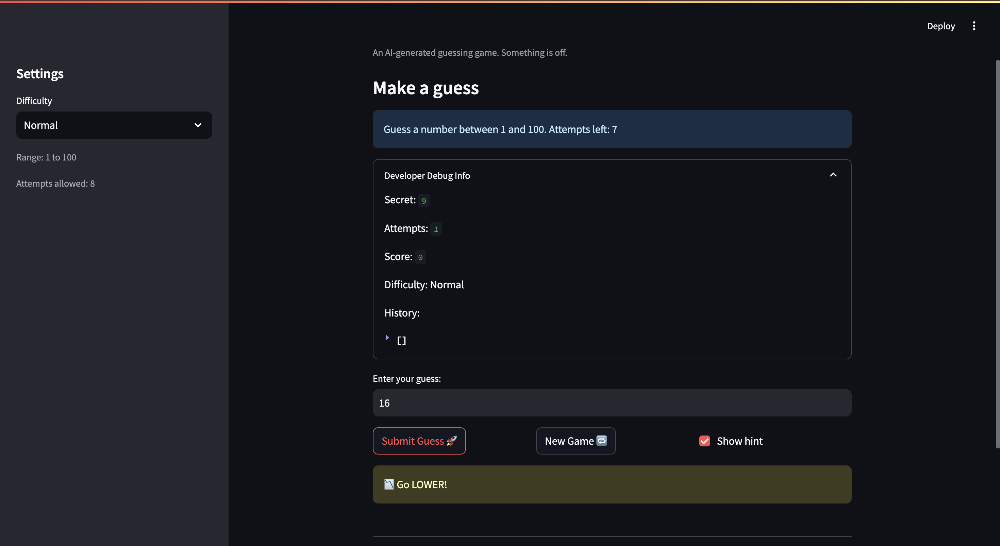
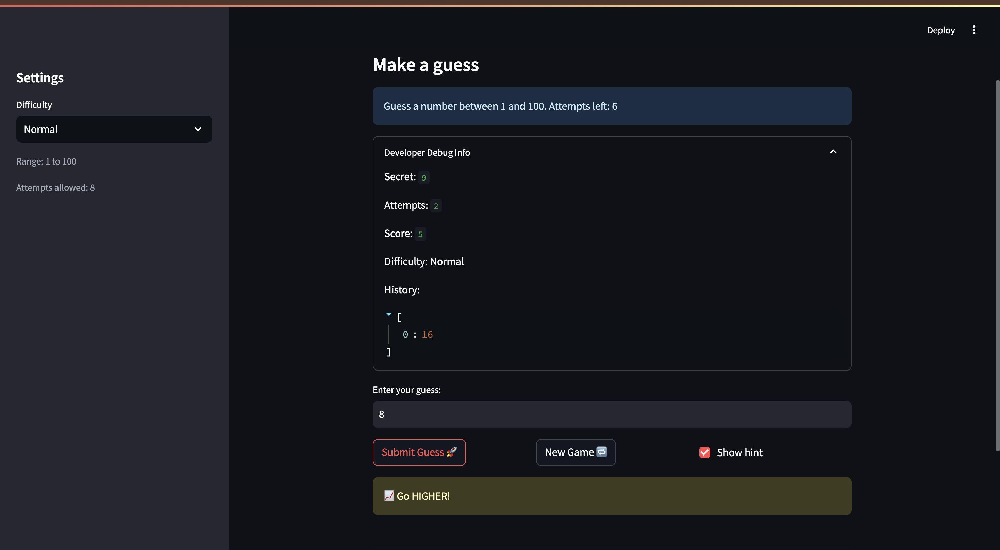
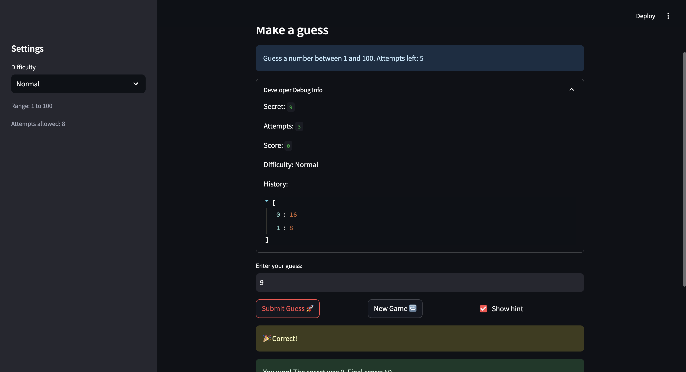
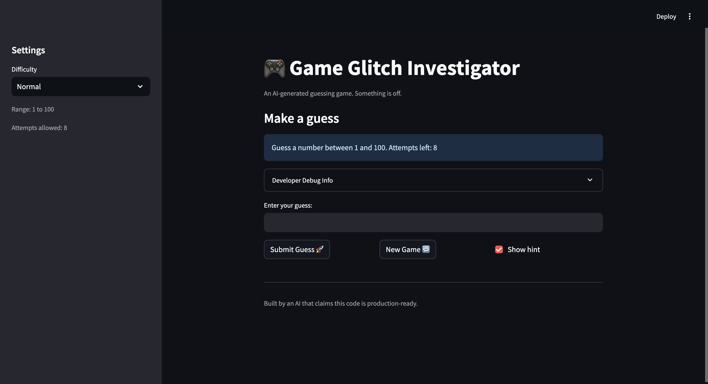

# 🎮 Game Glitch Investigator: The Impossible Guesser

## 🚨 The Situation

You asked an AI to build a simple "Number Guessing Game" using Streamlit.
It wrote the code, ran away, and now the game is unplayable.

- You can't win.
- The hints lie to you.
- The secret number seems to have commitment issues.

## 🛠️ Setup

1. Install dependencies: `pip install -r requirements.txt`
2. Run the broken app: `python -m streamlit run app.py`

## 🕵️‍♂️ Your Mission

1. **Play the game.** Open the "Developer Debug Info" tab in the app to see the secret number. Try to win.
2. **Find the State Bug.** Why does the secret number change every time you click "Submit"? Ask ChatGPT: _"How do I keep a variable from resetting in Streamlit when I click a button?"_
3. **Fix the Logic.** The hints ("Higher/Lower") are wrong. Fix them.
4. **Refactor & Test.** - Move the logic into `logic_utils.py`.
   - Run `pytest` in your terminal.
   - Keep fixing until all tests pass!

## 📝 Document Your Experience

- [ ] Describe the game's purpose.
      The game's purpose is to let players guess a randomly chosen secret number, using hints after each guess to figure out whether the next guess should be higher or lower until they win.
- [ ] Detail which bugs you found.

1. The hint that was given was opposite. Forexample, if the secret number was 5 and the user guessed 10, it would say go higher when it should have been go lower. The same was for opposite

2. When the "New game" button was clicked, the game just reran, but the state remained the same.

- [ ] Explain what fixes you applied.
      I fixed the game by addressing both state and logic issues. First, I stored game values in st.session_state so they persist across Streamlit reruns, which keeps the secret number stable during a round. Second, I corrected the guess logic in logic_utils.py so hints now match the comparison (Too High -> Go LOWER, Too Low -> Go HIGHER). Third, I updated the New Game flow to fully reset state each click (status, attempts, history, score) and generate a fresh secret number. I also added/used tests in tests/test_game_logic.py to verify win/high/low behavior and confirm that the New Game button correctly restarts the game every time.

## 📸 Demo

- [ ] [Insert a screenshot of your fixed, winning game here]
      
      
      
      

## 🚀 Stretch Features

- [ ] [If you choose to complete Challenge 4, insert a screenshot of your Enhanced Game UI here]
